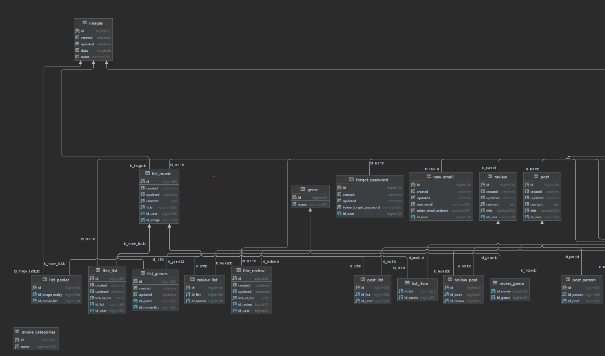
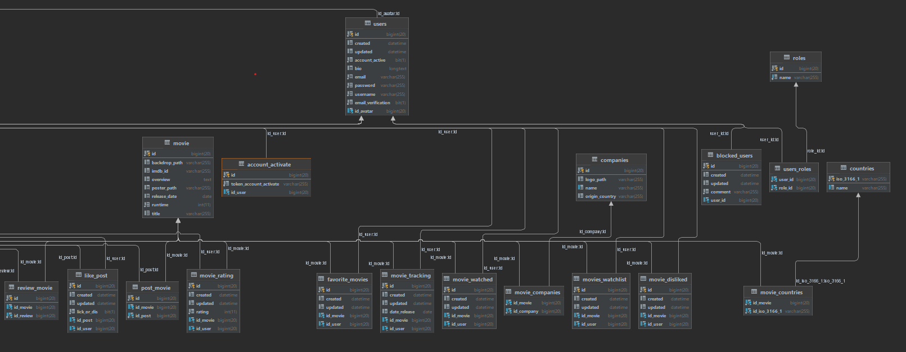

# MoviePocket Developer documentation

## Introduction

MoviePocket is movie management system that will help you to orginize your movie collection and
share it with other
movie lovers. The more percise description of the service you can find in Documentation/ section:)

Explore world of movies with MoviePocket and create your personal unforgettable experience
collecting sharing movies
between users.

## To start develop

1. [Introduction](#introduction)
2. [Backend (Java Spring)](#backend-java-spring)
    - [You will need](#you-will-need-)
    - [API Documentation](#api-documentation)
    - [Database Schema](#database-schema)
    - [Authentication](#authentication)
    - [Error Handling](#error-handling)
3. [Frontend (React.js)](#frontend-reactjs)
    - [Project Structure](#project-structure)
    - [Component Documentation](#component-documentation)
    - [API Integration](#api-integration)
4. [Mobile App Android](#mobile-app-android)
    - [General](#general)
    - [Dependencies](#dependencies)
    - [Configuration](#configuration)
    - [Architecture](#architecture)
    - [Error Handling](#error-handling)
    - [Networking](#networking)
    - [Authentication](#authentication)
5. [Deployment](#deployment)
    - [Backend And Frontend Deployment](#backend-and-frontend-deployment)
    - [Mobile App Deployment](#mobile-app-deployment)
6. [Contributing](#contributing)
    - [Version Control](#version-control)
    - [Testing](#testing)
    - [Changelog](#changelog)
7. [License](#license)

## Introduction

MoviePocket is movie management system that will help you to orginize your movie collection and
share it with other
movie lovers. The more percise description of the service you can find in Documentation/ section:)

Explore world of movies with MoviePocket and create your personal unforgettable experience
collecting sharing movies
between users.

## Backend Java [Spring](https://spring.io/)

### You will need:

- [Java(at least 1.8)](https://www.oracle.com/java/technologies/downloads/), **Spring boot** version
  at least 2.7.10 and
  Spring 5.X bounded with Maven for backend
    - Cookie based authentication by [Spring Security](https://spring.io/projects/spring-security)
      2.7
    - ORM: Hibernate v 5. + JPA
    - port used for local: _8080_

### API Documentation

Info about API endpoints, request/response examples, and any required headers generated by Swageer
UI and can be found
by ```{hostname}/swagger-ui.html ```

MVP pattern is used.


### Database Schema

MySql is used. DB script can be found in [DbScript](Documentation/DB_and_UI_prototypes/DbScript)

DB schema




### Authentication

Cookie based authentication is implemented. Cookie expiration set to -1 and can be changed
in [application.properties](src/main/resources/application.properties) file

### Error Handling

Most errors are handled by ResponseEntity and Http status codes responses
Main codes used are:

1. ```200 Ok```
2. ```401 Unauthorized```
3. ```403 Forbidden```
4. ```404 Not found```
5. ```500 Server error```

## Frontend [React.js](https://react.dev/reference/react)

### Project Structure

Describe the project directory structure and organization.

### Component Documentation

Document each React component, including its purpose, props, and usage.

- Component Buttons
    - [DislikedMovieButton](..%2FMoviePocket-Frontend%2Fsrc%2Fcomponents%2Fbuttons%2FDislikedMovieButton.js)
        - Purpose: The DislikedMovieButton component is a reusable React component designed to
          represent a button that allows users to dislike a movie. It interacts with the server to
          check the current disliked state of the movie and enables users to toggle the dislike
          state by clicking the button.
        - Props:
            - idMovie (Required, Number): The unique identifier of the movie for which the dislike
              button is being displayed.
            - className (Optional, String): Additional CSS class name(s) that can be provided to
              customize the styling of the button.
        - Usage: the DislikedMovieButton is used within a MovieDetails component, where idMovie is
          set to the unique identifier of the movie being displayed. The optional className prop is
          used to customize the styling of the button.

This component utilizes the AuthContext to check if the user is logged in before allowing them to
dislike a movie. When the button is clicked, it toggles the dislike state and sends a request to the
server to update the dislike status.

- [FavoriteMovieButton](..%2FMoviePocket-Frontend%2Fsrc%2Fcomponents%2Fbuttons%2FFavoriteMovieButton.js)
    - Purpose: The FavoriteMovieButton component is a reusable React component designed to represent
      a button that allows users to mark a movie as a favorite. It interacts with the server to
      check the current favorite state of the movie and enables users to toggle the favorite state
      by clicking the button.
    - Props:
        - idMovie (Required, String): The unique identifier of the movie for which the favorite
          button is being displayed.
        - className (Optional, String): Additional CSS class name(s) that can be provided to
          customize the styling of the button.
    - Usage:  the FavoriteMovieButton is used within a MovieDetails component, where idMovie is set
      to the unique identifier of the movie being displayed. The optional className prop is used to
      customize the styling of the button.
- [RatingComponent](..%2FMoviePocket-Frontend%2Fsrc%2Fcomponents%2Fbuttons%2FRatingComponent.js)
    - Purpose:  The RatingComponent is designed to provide a user interface for selecting a rating
      using star icons. It uses state to track the selected rating and updates the display
      dynamically.
    - Props: rating: A state variable that holds the selected rating. It is initially set to null
      and gets updated when a star is clicked.
- [ToWatchMovieButton](..%2FMoviePocket-Frontend%2Fsrc%2Fcomponents%2Fbuttons%2FToWatchMovieButton.js)
    - Purpose: The ToWatchMovieButton component serves as a button that allows users to add or
      remove movies from their "To Watch" list. It displays a tooltip and changes its appearance
      based on whether the movie is in the "To Watch" list or not.
    - Props:
        - toWatch: A state variable that holds whether the movie is in the "To Watch" list. It is
          initially set to false and gets updated when the user clicks the button.
        - isLoggedIn: The component uses the AuthContext to check if the user is logged in.
- [WatchMovieButton.js](..%2FMoviePocket-Frontend%2Fsrc%2Fcomponents%2Fbuttons%2FWatchMovieButton.js)
    - Purpose: The WatchMovieButton component serves as a button that allows users to mark a movie
      as watched. It displays a tooltip and changes its appearance based on whether the movie has
      been watched or not.
    - Props:
        - watched: A state variable that holds whether the movie has been watched. It is initially
          set to false and gets updated when the user clicks the button.
        - isHovered: A state variable that holds whether the button is being hovered. It is used to
          determine the button's appearance during hover.
        - isClicked: A state variable that holds whether the button has been clicked. It is used to
          determine the button's appearance after being clicked.
- Component [Lists](..%2FMoviePocket-Frontend%2Fsrc%2Fcomponents%2Flists)
    - [ListOfFilms](..%2FMoviePocket-Frontend%2Fsrc%2Fcomponents%2Flists%2FListOfFilms.js)
    - [SingleList](..%2FMoviePocket-Frontend%2Fsrc%2Fcomponents%2Flists%2FSingleList.js)
    - [UserLikedList](..%2FMoviePocket-Frontend%2Fsrc%2Fcomponents%2Flists%2FUserLikedList.js)
- Component [navbar](..%2FMoviePocket-Frontend%2Fsrc%2Fcomponents%2Fnavbar)
    - [logoBar](..%2FMoviePocket-Frontend%2Fsrc%2Fcomponents%2Fnavbar%2FlogoBar)
    - [logOutComponent](..%2FMoviePocket-Frontend%2Fsrc%2Fcomponents%2Fnavbar%2FlogOutComponent)
    - [navBar](..%2FMoviePocket-Frontend%2Fsrc%2Fcomponents%2Fnavbar%2FnavBar)
    - [navBrand](..%2FMoviePocket-Frontend%2Fsrc%2Fcomponents%2Fnavbar%2FnavBrand)
    - [navList](..%2FMoviePocket-Frontend%2Fsrc%2Fcomponents%2Fnavbar%2FnavList)
    - [searchComponent](..%2FMoviePocket-Frontend%2Fsrc%2Fcomponents%2Fnavbar%2FsearchComponent)
    - [userBarComponent](..%2FMoviePocket-Frontend%2Fsrc%2Fcomponents%2Fnavbar%2FuserBarComponent)
- Component [pagination](..%2FMoviePocket-Frontend%2Fsrc%2Fcomponents%2Fpagination)
    - [Pagination](..%2FMoviePocket-Frontend%2Fsrc%2Fcomponents%2Fpagination%2FPagination.js)
- Component [poster](..%2FMoviePocket-Frontend%2Fsrc%2Fcomponents%2Fposter)
    - [MoviePoster](..%2FMoviePocket-Frontend%2Fsrc%2Fcomponents%2Fposter%2FMoviePoster.js)
    - [Poster](..%2FMoviePocket-Frontend%2Fsrc%2Fcomponents%2Fposter%2FPoster.js)
- Component [review](..%2FMoviePocket-Frontend%2Fsrc%2Fcomponents%2Freview)
    - [CreateReviewForm.js](..%2FMoviePocket-Frontend%2Fsrc%2Fcomponents%2Freview%2FCreateReviewForm.js)
    - [LikeReviewButton.js](..%2FMoviePocket-Frontend%2Fsrc%2Fcomponents%2Freview%2FLikeReviewButton.js)
    - [ReviewDeleteButton.js](..%2FMoviePocket-Frontend%2Fsrc%2Fcomponents%2Freview%2FReviewDeleteButton.js)
    - [SingleReview.js](..%2FMoviePocket-Frontend%2Fsrc%2Fcomponents%2Freview%2FSingleReview.js)
- Component [spinners](..%2FMoviePocket-Frontend%2Fsrc%2Fcomponents%2Fspinners)
    - [Spinner](..%2FMoviePocket-Frontend%2Fsrc%2Fcomponents%2Fspinners%2FSpinner.js)
- Component [top](..%2FMoviePocket-Frontend%2Fsrc%2Fcomponents%2Ftop)
    - [Top](..%2FMoviePocket-Frontend%2Fsrc%2Fcomponents%2Ftop%2FTop.js)
- Component [Layout](..%2FMoviePocket-Frontend%2Fsrc%2Fcomponents%2FLayout.js)

### API Integration

Service is using
external [TMDB APi](https://developer.themoviedb.org/reference/intro/getting-started) for several
operations such as poster and movie info fetching etc.

## Mobile App [Android](https://developer.android.com/)

### General

Android 10+ should be used for running

App uses mainly MVC pattern and uses both backend api endpoints and TMDB API.

### Dependencies

implementation 'androidx.viewpager2:viewpager2:1.0.0' implementation of 'com.tbuonomo:dotsindicator:
4.2' compileOnly '
org.projectlombok:lombok:1.18.30' annotationProcessor 'org.projectlombok:lombok:1.18.30'
implementation of 'jp.wasabeef:
blurry:4.0.0' implementation of 'com.google.code.gson:gson:2.8.9' implementation of "
androidx.viewpager2:viewpager2:
1.0.0"
implementation of 'com.google.android.exoplayer:exoplayer:2.19.1' implementation 'com.ms-square:
expandableTextView:
0.1.4' implementation 'com.github.bumptech.glide:glide:4.12.0' implementation 'androidx.legacy:
legacy-support-v4:1.0.0'
implementation 'androidx.lifecycle:lifecycle-livedata-ktx:2.4.1' implementation 'androidx.lifecycle:
lifecycle-viewmodel-ktx:2.4.1' implementation of 'androidx.navigation:navigation-fragment:2.5.2'
implementation '
androidx.navigation:navigation-ui:2.5.2' implementation 'androidx.recyclerview:recyclerview:1.3.2'
annotationProcessor '
com.github.bumptech.glide:compiler:4.12.0' implementation of 'com.squareup.okhttp3:okhttp:4.9.1'
implementation '
androidx.appcompat:appcompat:1.6.1' implementation 'com.google.android.material:material:1.9.0'
implementation '
androidx.constraintlayout:constraintlayout:2.1.4' testImplementation 'junit:junit:4.13.2'
androidTestImplementation '
androidx.test.ext:junit:1.1.5' androidTestImplementation 'androidx.test.espresso:espresso-core:
3.5.1'

These libraries are used in my Android application for various purposes like ViewPager2 support,
adding dots indicator
to ViewPager, blur support, JSON parsing with Gson library, ExoPlayer media player support,
extensible text view,
loading images with Glide, support for LiveData and ViewModel architecture with Lifecycle,
navigation between fragments
with Navigation, support for RecyclerView scroll list, support for network communication with OkHttp
library, UI support
with AppCompat, Material Design and ConstraintLayout, testing with JUnit and testing user interface
using Espresso.

Remember to regularly update your libraries and track their versions to maintain security and
compliance with the latest
standards.

### Configuration

I'm using a Gradle build system for my Android app. Below is the build configuration:

1. Plugins:
    - 'com.android.application' - Plugin for building Android applications.
    - 'org.jetbrains.dokka' - Plugin for generating documentation from source code.

2. Android Setup:
    - namespace - The namespace of the Android application.
    - compileSdk - The SDK version the application uses.
    - defaultConfig - Default configuration, including, among others: application ID, minimum and
      target SDK versions,
      version code, and version name.
    - buildTypes - Configuration of build types, e.g. "release" mode with minification and ProGuard
      files enabled or
      disabled.
    - compileOptions - Compilation settings such as source and target code compatibility with Java
      11.
    - buildFeatures - View Binding feature enabled.

3. Plugins version:
    - 'com.android.application' and 'com.android.library' in version '8.1.4', but they are
      disabled (apply false).

The above configuration describes how to build, compile and configure Android applications using
Gradle.

### Architecture

A general idea of the application architecture:

Your app uses an architectural approach using the Android Navigation Component to manage navigation
between fragments.
The application probably uses a Single Activity approach, where the main activity contains a
container for displaying
fragments and manages their visibility.

Basic components and their interactions:

1. MainActivity:
    - The main activity of the application, which contains a container for displaying fragments.
    - Responsible for initialization and management of the Navigation Component.

2. Fragments:
    - HomeFragment: Displays the home screen and contains links to various fragments such as
      movieFragment,
      loginFragment, movieListFragment and listFragment.
    - SearchFragment: Responsible for displaying the search screen and contains links to various
      fragments such as
      movieFragment, personFragment, searchResultsFragment and others.
    - UserFragment: Displays the user's screen and contains links to various fragments such as
      movieFragment,
      movieTokFragment, loginFragment and userEditFragment.
    - MovieFragment, PersonFragment, MovieTokFragment, LoginFragment and others: Screens to display
      information about
      movies, people, reviews, etc.
    - FeedFragment, FeedListFragment, FeedPostFragment: Screens related to displaying news and its
      components.

3. Navigation graphics:
    - Defined in the navigation XML file (res/navigation/mobile_navigation.xml).
    - Contains fragments and actions to manage navigation between them.

4. adapter: A package containing various adapters for displaying data in lists and other interface
   components.

    - search: A subpackage with adapters related to search.

5. animation: A package where, presumably, the Animation class is located. It might be related to
   animations in the
   application.

6. api: A package containing classes for interacting with external APIs.

    - models: Data models designed for working with external APIs. Here, models for lists of movies,
      episodes, actors,
      etc., are presented.

    - MP: A subpackage, possibly related to the internal API of your project. It includes classes
      for various aspects of
      the API, such as ratings, authentication, lists, etc.

    - TMDB: A subpackage related to The Movie Database (TMDB) API.

7. ui: A package containing classes for the user interface.

    - dialog: Classes for working with dialogs, including RatingDialog.

    - feed: Classes related to the news feed, including fragments and view models.

    - firstRun: The FirstRunActivity class, associated with the first launch of the application.

    - home: Classes associated with the home screen of the application.

    - list: Fragments and view models for working with various lists.

    - login: Classes related to the login process.

    - lostPassword: Classes related to password recovery.

    - movie: Classes related to displaying information about movies.

    - movieTok: The MovieTokFragment class, possibly associated with some movie-related
      functionality.

    - person: Classes related to displaying information about individuals.

    - post: Classes related to posts and their editing.

    - registration: Classes related to the registration process.

    - review: Classes related to movie reviews.

    - search: Classes related to search functionality.

    - settings: Classes related to application settings.

    - style: The StyleActivity class, associated with styling the application.

    - user: Classes related to users.

8. utils: Utility classes, such as date conversion, image handling, internet connection checking,
   and other auxiliary
   functions.

9. view: A package containing custom widgets or widgets with modified behavior.

    - circularImageView: A widget for circular images.

    - roundedImageView: A widget for images with rounded corners.

10. MainActivity.java: The main class of your application, which is likely the entry point.

11. MainApplication.java: The application class where application initialization and setup occur.

12. MoviePocketApi.java: Possibly a class related to the API of your application.

13. R.java: An automatically generated file containing references to resources.

Gradle:

* Plugins:
    * com.android.application: Plugin for building Android applications.
    * org.jetbrains.dokka: Plugin for generating documentation from code.

* Android Settings:
    * Namespace: Application namespace com.example.moviepocketandroid.
    * Compile SDK: SDK version for compilation - 33.

* Primary Configuration:
    * Application ID: Application identifier in the package - com.moviepocket.
    * Minimum SDK Version: 28.
    * Target SDK Version: 33.
    * Application Version: Version code - 2, version name - "2".
    * Test Runner: Instrumentation runner used for tests - "
      androidx.test.runner.AndroidJUnitRunner".

* Build Types:
    * Release:
        * Optimizations: Disabled (minifyEnabled false).
        * Proguard: Proguard configuration files for optimization and code protection.

* Language Settings:
    * Java Language Version: 11.
    * View Binding: Enabled.

### Error Handling

Handling errors in the application involves the following steps:

IllegalStateException:
In the event of an IllegalStateException, the application takes the following steps:

Checks if the fragment is added to the activity (isAdded()). Checks if the context is not equal to
null (getContext() !=
null). If both checks pass, corresponding actions are executed. In this case, the onDestroy() method
is called to
perform necessary cleanup or other actions. NullPointerException:
In the event of a NullPointerException, the application takes the following steps:

Logs an error message containing information about the exception (Log.e(TAG, "NullPointerException
occurred: " +
e.getMessage())). Performs additional error handling according to the application's requirements.
This may include
notifying the user, displaying an error message, etc.

### Networking

Network interactions:

- Details of interactions with backend servers or APIs:
    - The application communicates with backend servers using two secured protocols: HTTPS (HTTP
      Secure) to encrypt
      transmitted data and ensure the security of communication between the client and the server.

- API endpoints and their functionality:
    - Two APIs are used: The Movie Database (TMDb) and the MoviePocket API. Each of them provides
      API endpoints with
      various functionalities, such as obtaining information about videos, searching, updating data,
      and other
      operations necessary for the functioning of the application.

- Handling HTTP requests and responses:
    - All HTTP requests and responses are handled according to security policies. The application
      sends secured HTTP
      requests to APIs using HTTPS. Response processing includes checking statuses and processing
      data for display or
      further use in the application.

This ensures safe and effective interaction of the application with backend servers through secured
data transmission
protocols.

### Authentication

Authentication flow is depends on Backend part as it uses backend api
see [Backend (Java Spring)](#backend-java-spring)

### Deployment

#### Backend and Frontend Deployment

Both front and back end are deployed on remote linux server provided
by [UAM WMI](https://wmi.amu.edu.pl/en)

Server information and connection credentials can be
found [Here](Documentation%2FDeploy%2FNowa_maszyna_wirtualna_Helpdesk_WMI_Biuro_Obs%3Fugi_Klienta.pdf)

#### Mobile App Deployment

Android app is deployed
to [Google Play](https://play.google.com/store/apps/details?id=com.moviepocket)

Deployment provider: [Schizo Cat](https://play.google.com/store/apps/dev?id=6707405097009647771)

Contact: goggigameproduction@gmail.com

## Contributing

### Version Control

Backend: https://github.com/prymakD/MoviePocket

Frontend: https://github.com/EkintoQ/MoviePocket-Frontend

Android: https://github.com/AntonPazniak/MoviePocketAndroid/tree/master

### Testing

[JUnit5](https://junit.org/junit5/) and [Mockito](https://site.mockito.org/) libraries are used for
backend testing
[Jacoco](https://github.com/jacoco/jacoco) for static code coverage analysis


### Changelog

v. 1.0.0

## License

[Proprietary license](https://en.wikipedia.org/wiki/Proprietary_software)

Please add header to created files

```
/**
* Copyright (C) {MoviePocket} - All Rights Reserved
*
* This source code is protected under international copyright law.  All rights
* reserved and protected by the copyright holders.
* This file is confidential and only available to authorized individuals with the
* permission of the copyright holders.  If you encounter this file and do not have
* permission, please contact the copyright holders and delete this file.
  */ ```
